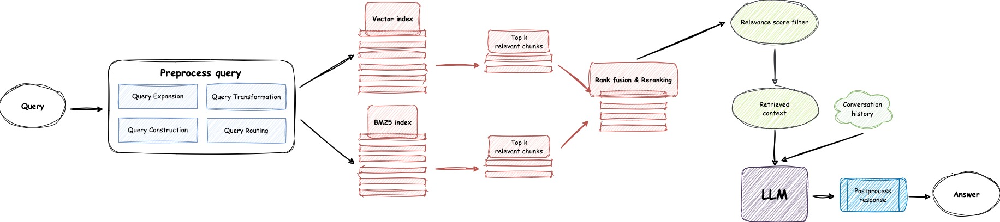

# Smart Spreadsheet


# Contents

- [Introduction](#introduction)
- [Online Retrieval Architecture](#online-retrieval-architecture)
- [Deploy the Smart-Spreadsheet service](#deploy-the-smart-spreadsheet-service)
  - [Step 1: Download repository code](#step-1-download-repository-code)
  - [Step 2: Configure variables of .env](#step-2-configure-variables-of-env)
  - [Step 3: Deploy Smart-Spreadsheet](#step-3-deploy-smart-spreadsheet)
    - [Deploy Smart-Spreadsheet using Docker](#deploy-smart-spreadsheet-using-docker)
    - [Deploy Smart-Spreadsheet from source code](#deploy-smart-spreadsheet-from-source-code)
      - [Set up the Python running environment](#set-up-the-python-running-environment)
        - [Create and activate a virtual environment](#create-and-activate-a-virtual-environment)
        - [Install dependencies with pip](#install-dependencies-with-pip)
      - [Create SQLite Database](#create-sqlite-database)
      - [Start the service](#start-the-service)
- [Configure the admin console](#configure-the-admin-console)
  - [Login to the admin console](#login-to-the-admin-console)
  - [Import your data](#import-your-data)
    - [import local files](#import-local-files)
  - [Test the Chatbot](#test-the-chatbot)
  - [Embed on your website](#embed-on-your-website)
  - [Dashboard of user's historical request](#dashboard-of-users-historical-request)


## Introduction

This exercise mainly includes the following tasks:

- Parsing EXCEL files and extracting detailed information from them.
- Using RAG + LLM to build a knowledge base QA Bot.

### EXCEL Parsing

There are 3 EXCEL files in the Tests directory, which primarily contain financial-related table information.
Two approaches have been adopted to parse the EXCEL files and extract the information:

- By using `openpyxl` to parse the EXCEL files and extract all the table information. Each table is converted into a separate markdown table. The code is in `tests/extract_table.py`, and the output for the 3 test files is located in the directory `tests/output`.
- Using [LlamaParse](https://docs.llamaindex.ai/en/stable/llama_cloud/llama_parse/) to parse the EXCEL files, writing all the content from the EXCEL tables into a single markdown or txt file. The code is `tests/extract_content_by_llama_parse.py`, and the output for the 3 test files is in the directory `tests/output_of_llama_parse`. To use `LlamaParse`, we first need to apply for an `API Key` at [cloud.llamaindex.ai](https://cloud.llamaindex.ai/api-key).


> [!NOTE]
> 
> - In this exercise, since the example EXCEL files predominantly contain tables, we use `openpyxl`. By leveraging certain attributes of `[cell.border](https://openpyxl.readthedocs.io/en/latest/api/openpyxl.styles.borders.html)`, we can determine the area of each table and then extract the corresponding content.
> - By collecting the `number_format` attribute from the EXCEL example files, we can ensure that the extracted cell values remain consistent with how they are displayed in EXCEL.
> - Here, we are converting the content of tables in EXCEL into markdown. For values with spaces (indentation), we maintain the indentation by replacing spaces with `&nbsp;`.
> - If an EXCEL file contains multiple tables in a single row, `LlamaParse` does not handle this specifically, making it difficult to obtain independent and complete information for a specific table later. Using `openpyxl` to design relevant algorithms can solve such issues.
> - The default value of `USE_LLAMA_PARSE` is `0`, which means `LlamaParse` is not enabled.

### Knowledge Base QA Bot

Reusing the [RAG-GPT](https://github.com/gpt-open/rag-gpt) framework, tailored for the needs of Smart-Spreadsheet, integrating both of the aforementioned EXCEL parsing approaches. 


## Online Retrieval Architecture

<div align="center">

</div>

This exercise uses Chroma as the vector database, where we calculate vectors from the information extracted from EXCEL and store them in Chroma. We only adopted semantic retrieval and did not use text retrieval.

> [!NOTE]
> 
> For structured data, such as DB and EXCEL, decisions on whether to perform vectorization should be based on actual business scenarios.
> 
> In certain scenarios, for structured data, we can extract the resource directory and explanatory content, or `metadata` such as `table names`, `table descriptions`, and `schemas`. We perform embedding only on this metadata, which is then incorporated into the application and subsequently called via `function calls`.
> 
> Maintaining the original precision of structured data might be preferable to vectorization. It is crucial to recognize that RAG serves merely as one component of the pipeline within the entire application, not its entirety.


## Deploy the Smart-Spreadsheet Service

### Step 1: Download repository code

Clone the repository:

```shell
git clone https://github.com/blmdxiao/Smart-Spreadsheet.git && cd Smart-Spreadsheet
```

### Step 2: Configure variables of .env

Before starting the Smart-Spreadsheet service, you need to modify the related configurations for the program to initialize correctly. 


```shell
cp env_example .env
```

The variables in .env

```shell
LLM_NAME="OpenAI"
OPENAI_API_KEY="xxxx"
GPT_MODEL_NAME="gpt-4-turbo"
MIN_RELEVANCE_SCORE=0.5
BOT_TOPIC="Smart-Spreadsheet"
URL_PREFIX="http://127.0.0.1:9000/"
USE_PREPROCESS_QUERY=1
USE_RERANKING=1
USE_DEBUG=0
USE_LLAMA_PARSE=0
LLAMA_CLOUD_API_KEY="xxxx"
```

- Don't modify **`LLM_NAME`**
- Modify the **`OPENAI_API_KEY`** with your own key. Please log in to the [OpenAI website](https://platform.openai.com/api-keys) to view your API Key.
- Update the **`GPT_MODEL_NAME`** setting, replacing `gpt-4-turbo` with `gpt-3.5-turbo` or `gpt-4o`.
- Change **`BOT_TOPIC`** to reflect your Bot's name. This is very important, as it will be used in `Prompt Construction`. Please try to use a concise and clear word, such as `Smart-Spreadsheet`.
- Adjust **`URL_PREFIX`** to match your website's domain. This is mainly for generating accessible URL links for uploaded local files. Such as `http://127.0.0.1:9000/web/download_dir/2024_05_20/d3a01d6a-90cd-4c2a-b926-9cda12466caf/example_0.xlsx`.
- For more information about the meanings and usages of constants, you can check under the `server/constant` directory.


### Step 3: Deploy Smart-Spreadsheet

#### Deploy Smart-Spreadsheet using Docker


```shell
docker-compose up --build
```

#### Deploy Smart-Spreadsheet from source code

> [!NOTE]
> Please use Python version 3.10.x or above.
> 

##### Set up the Python running environment

It is recommended to install Python-related dependencies in a Python virtual environment to avoid affecting dependencies of other projects.

###### Create and activate a virtual environment

If you have not yet created a virtual environment, you can create one with the following command:

```shell
python3 -m venv myenv
```

After creation, activate the virtual environment:

```shell
source myenv/bin/activate
```

###### Install dependencies with pip

Once the virtual environment is activated, you can use `pip` to install the required dependencies. 

```shell
pip install -r requirement.txt
```

##### Create SQLite Database

The Smart-Spreadsheet service uses SQLite as its storage DB. Before starting the Smart-Spreadsheet service, you need to execute the following command to initialize the database and add the default configuration for admin console.

```shell
python3 create_sqlite_db.py
```


##### Start the service

If you have completed the steps above, you can try to start the Smart-Spreadsheet service by executing the following command.

- **Start single process:**

```shell
python3 smart_spreadsheet_app.py
```

- **Start multiple processes:**

```shell
sh start.sh
```

> [!NOTE]
> - The service port for Smart-Spreadsheet is **`9000`**. During the first test, please try not to change the port so that you can quickly experience the entire product process.
> - We recommend starting the Smart-Spreadsheet service using **`start.sh`** in multi-process mode for a smoother user experience.


## Configure the admin console

### Login to the admin console

Access the admin console through the link **`http://127.0.0.1:9000/open-kf-admin/`** to reach the login page. The default username and password are **`admin`** and **`admin123`** (can be checked in `create_sqlite_db.py`).

<div align="center">

</div>

After logging in successfully, you will be able to see the configuration page of the admin console.


### Import your data

#### Import local files

Upload the required local files. You can upload up to `10` files at a time, and each file cannot exceed `30MB`. The following file types are currently supported: `[".xlsx"]`.

<div align="center">

</div>


Click the **Upload** button to upload an EXCEL file to the server. The server will initiate an asynchronous task to process the received file, with the initial task status set to `Recorded`. The frontend will periodically poll the file processing status until the task either fails or is successfully completed (at which point the status will be `Trained`).

<div align="center">

</div>

Click on a file name to view the list of chunk information after the file has been split.

> [!NOTE]
> 
> By adjusting the size of `MAX_CHUNK_LENGTH` in `server/constant/constants.py`, we can ensure that each table from the three example EXCEL files forms a separate chunk without further splitting.

<div align="center">

</div>

Click on a chunk to view its complete information.

<div align="center">

</div>


### Test the Chatbot

After importing local files in the admin console, you can experience the chatbot service through the link **`http://127.0.0.1:9000/open-kf-chatbot/`**.

<div align="center">

</div>


### Dashboard of user's historical request

Through the admin console link **`http://127.0.0.1:9000/open-kf-admin/#/dashboard`**, you can view the historical request records of all users within a specified time range.

<div align="center">

</div>


